---
## Front matter
title: "Отчёт по лабораторной работе №3"
subtitle: "Архитектура компьютера"
author: "Кузьмина Мария Константиновна"

## Generic otions
lang: ru-RU
toc-title: "Содержание"

## Bibliography
bibliography: bib/cite.bib

## Pdf output format
toc: true # Table of contents
toc-depth: 2
lof: true # List of figures
lot: true # List of tables
fontsize: 12pt
linestretch: 1.5
papersize: a4
documentclass: scrreprt
## I18n polyglossia
polyglossia-lang:
  name: russian
  options:
	- spelling=modern
	- babelshorthands=true
polyglossia-otherlangs:
  name: english
## I18n babel
babel-lang: russian
babel-otherlangs: english
## Fonts
mainfont: IBM Plex Serif
romanfont: IBM Plex Serif
sansfont: IBM Plex Sans
monofont: IBM Plex Mono
mathfont: STIX Two Math
mainfontoptions: Ligatures=Common,Ligatures=TeX,Scale=0.94
romanfontoptions: Ligatures=Common,Ligatures=TeX,Scale=0.94
sansfontoptions: Ligatures=Common,Ligatures=TeX,Scale=MatchLowercase,Scale=0.94
monofontoptions: Scale=MatchLowercase,Scale=0.94,FakeStretch=0.9
mathfontoptions:
## Biblatex
biblatex: true
biblio-style: "gost-numeric"
biblatexoptions:
  - parentracker=true
  - backend=biber
  - hyperref=auto
  - language=auto
  - autolang=other*
  - citestyle=gost-numeric
## Pandoc-crossref LaTeX customization
figureTitle: "Рис."
tableTitle: "Таблица"
listingTitle: "Листинг"
lofTitle: "Список иллюстраций"
lotTitle: "Список таблиц"
lolTitle: "Листинги"
## Misc options
indent: true
header-includes:
  - \usepackage{indentfirst}
  - \usepackage{float} # keep figures where there are in the text
  - \floatplacement{figure}{H} # keep figures where there are in the text
---

# Цель работы

Целью работы является освоение процедуры оформления отчетов с
помощью легковесного языка разметки Markdown.

# Описание источников

В книге Таненбаума [@tanenbaum_book_modern-os_ru] описаны основы операционных систем. Также представлены сведения о bash, которые можно найти у Роббинса [@robbins_book_bash_en] и Заррелли [@zarrelli_book_mastering-bash_en]. Начальные сведения по bash также освещены в книге Ньюхэма [@newham_book_learning-bash_en].

# Задание

1. Установка необходимого ПО
2. Заполнение отчета по выполнению лабораторной работы 3 с помощью языка
разметки Markdown
3. Задание для самостоятельной работы

# Выполнение лабораторной работы

## 1. Установка необходимого ПО
Скачиваем TeX Live и Pandoc.

Переходим в папку "Загрузки", распаковываем архив TeX Live с помощью
команды zcat (рис. [-@fig:001]):

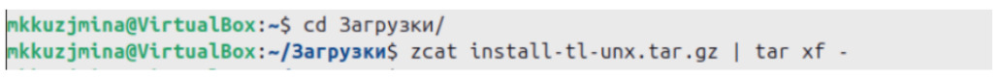{#fig:001 width=100%}

Переходим в папку с распакованным установщиком TeX Live и запускаем
установку TeX Live (рис. [-@fig:002]):

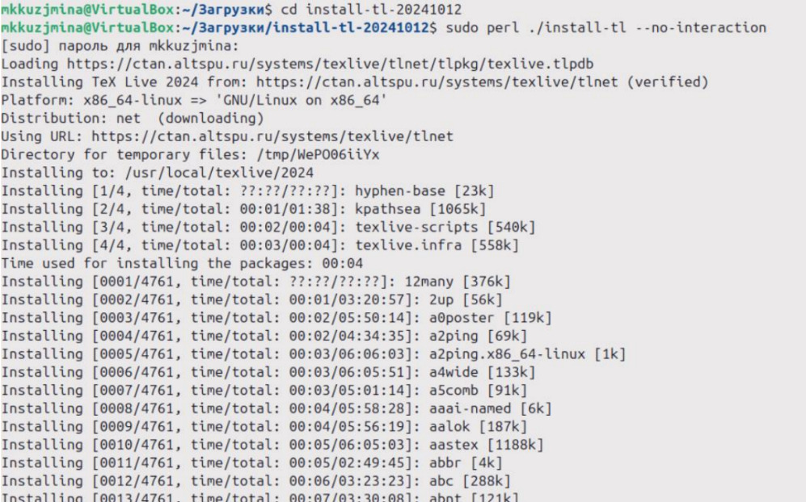{#fig:002 width=100%}

Добавляем /usr/local/texlive/2024/bin/x86_64-linux в свой PATH для текущей и
будущих сессий (рис. [-@fig:003]):

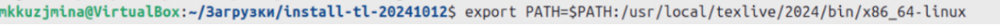{#fig:003 width=100%}

Скачиваем архив pandoc 3.4 (рис. [-@fig:004]):

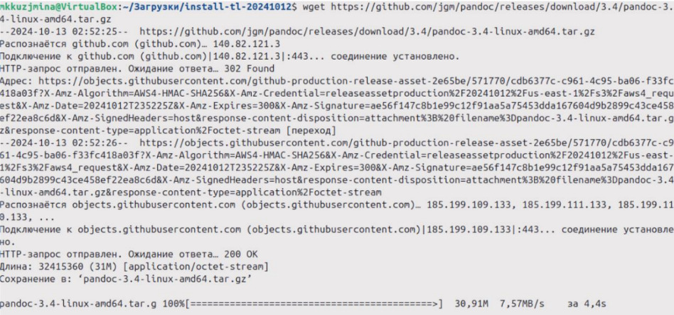{#fig:004 width=100%}

Скачиваем архив pandoc-crossref 0.3.18.0 (рис. [-@fig:005]):

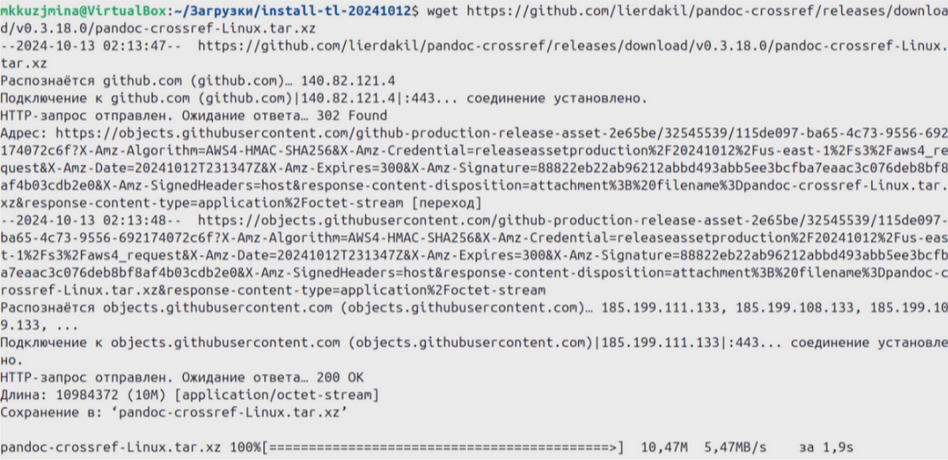{#fig:005 width=100%}

Распаковываем архив Pandoc и Pandoc Crossref с помощью команды tar (рис. [-@fig:006]):

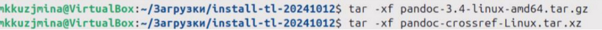{#fig:006 width=100%}

Копируем файл Pandoc и Pandoc Crossref в системную директорию
/usr/local/bin/ (рис. [-@fig:007]):

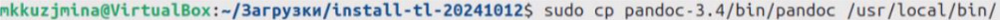{#fig:007 width=100%}

(рис. [-@fig:008]):

{#fig:008 width=100%}

Проверяем, что файлы pandoc и pandoc-crossref находятся в системной директории (рис. [-@fig:009]):

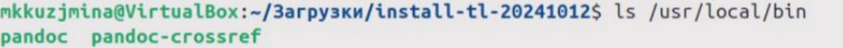{#fig:009 width=100%}

## Заполнение отчета по выполнению лабораторной работы No3 с помощью языка разметки Markdown

Переходим в рабочую директорию (рис. [-@fig:010]):

{#fig:010 width=100%}

(рис. [-@fig:011]):

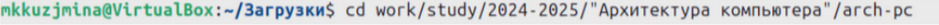{#fig:011 width=100%}

Обновляем локальный репозиторий с удаленного с помощью git pull (рис. [-@fig:012]):

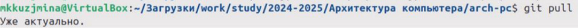{#fig:012 width=100%}

## Задание для самостоятельной работы

Переходим в папку отчета лабораторной работы (рис. [-@fig:013]):

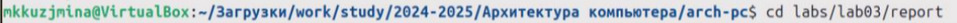{#fig:013 width=100%}

С помощью команды make компилируем отчет из Markdown с использованием
Pandoc и Crossref (рис. [-@fig:014]):

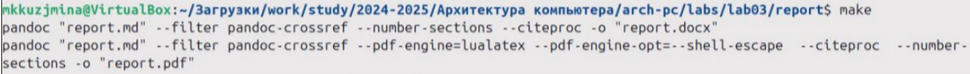{#fig:014 width=100%}

Очищаем временные файлы отчета с помощью команды make clean (рис. [-@fig:015]):

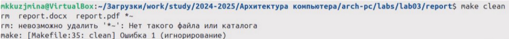{#fig:015 width=100%}

Открываем файл report.md с помощью текстового редактора nano и заполняем
отчет (рис. [-@fig:016]):

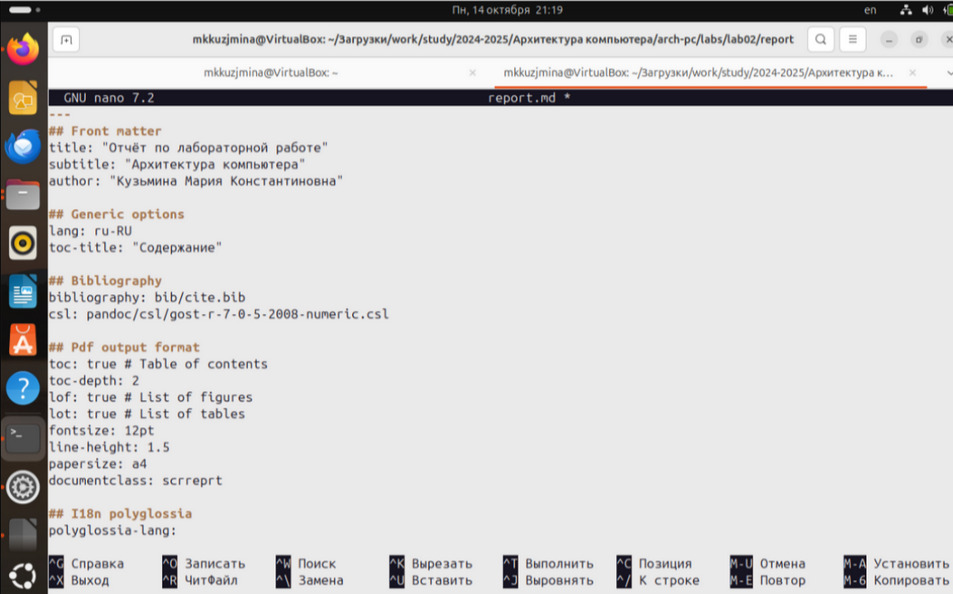{#fig:016 width=100%}

Добавляем файлы отчета в форматах .md, .pdf и .docx в git и создаем коммит с
сообщением о добавлении отчета в трех форматах (рис. [-@fig:017]):

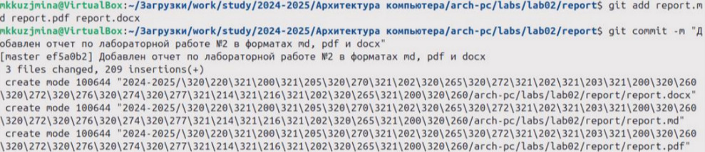{#fig:017 width=100%}

Отправляем коммит с изменениями на удаленный репозиторий на ветку
master (рис. [-@fig:018]):

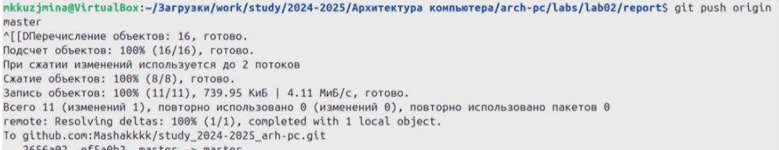{#fig:018 width=100%}

# Вывод
Освоены основные синтаксические конструкции для структурирования текста и
добавления элементов оформления. Также изучен инструмент Pandoc для
конвертации Markdown в различные форматы (pdf, docx)

# Список литературы{.unnumbered}

::: {#refs}
:::
