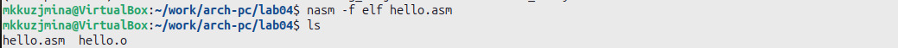
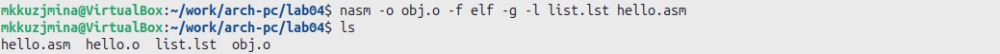
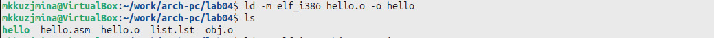
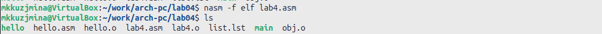
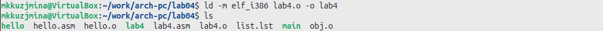

---
## Front matter
title: "Отчёт по лабораторной работе №4"
subtitle: "Дисциплина: Архитектура компьютера"
author: "Кузьмина Мария Константиновна"

## Generic otions
lang: ru-RU
toc-title: "Содержание"

## Bibliography
bibliography: bib/cite.bib

## Pdf output format
toc: true # Table of contents
toc-depth: 2
lof: true # List of figures
fontsize: 12pt
linestretch: 1.5
papersize: a4
documentclass: scrreprt
## I18n polyglossia
polyglossia-lang:
  name: russian
  options:
	- spelling=modern
	- babelshorthands=true
polyglossia-otherlangs:
  name: english
## I18n babel
babel-lang: russian
babel-otherlangs: english
## Fonts
mainfont: IBM Plex Serif
romanfont: IBM Plex Serif
sansfont: IBM Plex Sans
monofont: IBM Plex Mono
mathfont: STIX Two Math
mainfontoptions: Ligatures=Common,Ligatures=TeX,Scale=0.94
romanfontoptions: Ligatures=Common,Ligatures=TeX,Scale=0.94
sansfontoptions: Ligatures=Common,Ligatures=TeX,Scale=MatchLowercase,Scale=0.94
monofontoptions: Scale=MatchLowercase,Scale=0.94,FakeStretch=0.9
mathfontoptions:
## Biblatex
biblatex: true
biblio-style: "gost-numeric"
biblatexoptions:
  - parentracker=true
  - backend=biber
  - hyperref=auto
  - language=auto
  - autolang=other*
  - citestyle=gost-numeric
## Pandoc-crossref LaTeX customization
figureTitle: "Рис."
listingTitle: "Листинг"
lofTitle: "Список иллюстраций"
lolTitle: "Листинги"
## Misc options
indent: true
header-includes:
  - \usepackage{indentfirst}
  - \usepackage{float} # keep figures where there are in the text
  - \floatplacement{figure}{H} # keep figures where there are in the text
---

# Цель работы

Освоение процедуры компиляции и сборки программ, написанных на ассемблере NASM.

# Задание

1. Создание программы Hello world!
2. Работа с транслятором NASM и компоновщиком ld
3. Запуск исполняемого файла
4. Выполнение заданий для самостоятельной работы.

# Выполнение лабораторной работы

## Создание программы Hello world!
С помощью команды mkdir -p создаём директорию lab04 по указанному пути (рис. [-@fig:001]):

{#fig:001 width=100%}

С помощью команды cd переходим в директорию lab04, которую только что создали(рис. [-@fig:002]):

{#fig:002 width=100%}

С помощью команды touch создаём пустой файл с именем hello.asm(рис. [-@fig:003]):

{#fig:003 width=100%}

С помощью команды mousepad открываем файл hello.asm в текстовом редакторе Mousepad(рис. [-@fig:004]):

{#fig:004 width=100%}

## Работа с транслятором NASM и компоновщиком ld

С помощью команды nasm компилируем файл hello.asm в объектный файл hello.o с использованием формата ELF. С помощью команды ls отображаем содержимое текущей директории, чтобы убедиться, что файлы были созданы и скомпилированы (рис. [-@fig:005]):

{#fig:005 width=100%}

С помощью команды nasm создаём объектный файл obj.o из hello.asm, добавляя отладочную информацию и файл листинга list.lst (рис. [-@fig:006]):

{#fig:006 width=100%}

С помощью команды ld связываем объектный файл hello.o и создаём исполняемый файл hello (рис. [-@fig:007]):

{#fig:007 width=100%}

С помощью команды ld связываем объектный файл obj.o и создаём другой исполняемый файл под именем main (рис. [-@fig:008]):

{#fig:008 width=100%}

## Запуск исполняемого файла

С помощью команды ./hello запускаем исполняемый файл hello, выводящий на экран строку Hello world! (рис. [-@fig:009]):

{#fig:009 width=100%}

## Выполнение заданий для самостоятельной работы.

С помощью команды cp копируем файл hello.asm в новый файл с именем lab4.asm 
С помощью команды mousepad открываем файл lab4.asm для редактирования в редакторе Mousepad (рис. [-@fig:010]):

{#fig:010 width=100%}

С помощью команды nasm компилируем файл lab4.asm в объектный файл lab4.o в формате ELF (рис. [-@fig:011]):

{#fig:011 width=100%}

С помощью команды ld связываем объектный файл lab4.o и создаём исполняемый файл lab4 (рис. [-@fig:012]):

{#fig:012 width=100%}

С помощью команды ./lab4 запускаем исполняемый файл lab4, который выводит строку Kuzmina Maria! (рис. [-@fig:013]):

{#fig:013 width=100%}

# Выводы

При выполнении лабораторной работы были освоены процедуры компиляции и сборки программ, написанных на ассемблере NASM.

