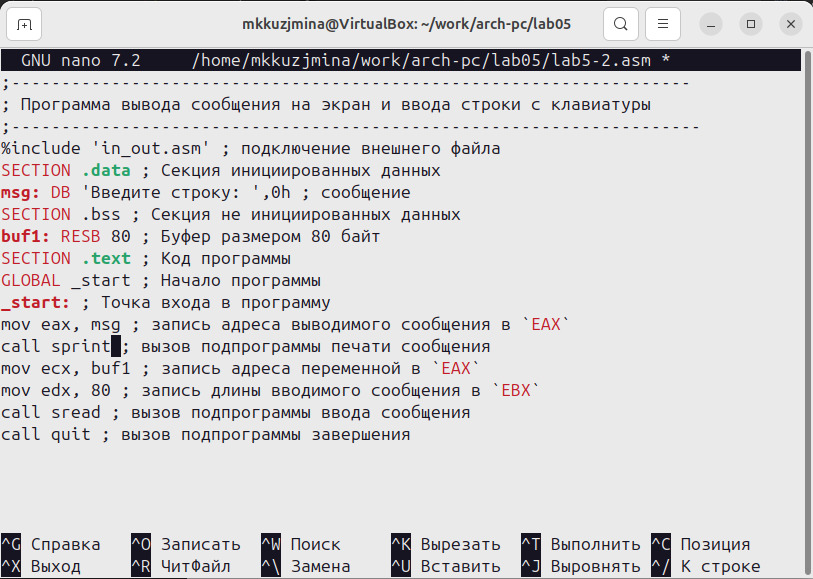
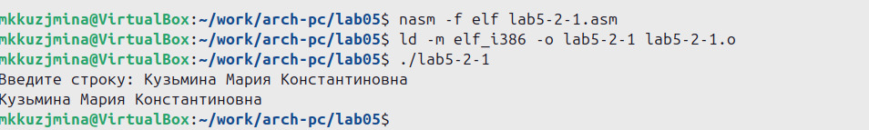

---
## Front matter
title: "Отчёт по лабораторной работе №5"
subtitle: "Дисциплина: Архитектура компьютера"
author: "Кузьмина Мария Константиновна"

## Generic otions
lang: ru-RU
toc-title: "Содержание"

## Bibliography
bibliography: bib/cite.bib

## Pdf output format
toc: true # Table of contents
toc-depth: 2
lof: true # List of figures
fontsize: 12pt
linestretch: 1.5
papersize: a4
documentclass: scrreprt
## I18n polyglossia
polyglossia-lang:
  name: russian
  options:
	- spelling=modern
	- babelshorthands=true
polyglossia-otherlangs:
  name: english
## I18n babel
babel-lang: russian
babel-otherlangs: english
## Fonts
mainfont: IBM Plex Serif
romanfont: IBM Plex Serif
sansfont: IBM Plex Sans
monofont: IBM Plex Mono
mathfont: STIX Two Math
mainfontoptions: Ligatures=Common,Ligatures=TeX,Scale=0.94
romanfontoptions: Ligatures=Common,Ligatures=TeX,Scale=0.94
sansfontoptions: Ligatures=Common,Ligatures=TeX,Scale=MatchLowercase,Scale=0.94
monofontoptions: Scale=MatchLowercase,Scale=0.94,FakeStretch=0.9
mathfontoptions:
## Biblatex
biblatex: true
biblio-style: "gost-numeric"
biblatexoptions:
  - parentracker=true
  - backend=biber
  - hyperref=auto
  - language=auto
  - autolang=other*
  - citestyle=gost-numeric
## Pandoc-crossref LaTeX customization
figureTitle: "Рис."
listingTitle: "Листинг"
lofTitle: "Список иллюстраций"
lolTitle: "Листинги"
## Misc options
indent: true
header-includes:
  - \usepackage{indentfirst}
  - \usepackage{float} # keep figures where there are in the text
  - \floatplacement{figure}{H} # keep figures where there are in the text
---

# Цель работы

Приобретение практических навыков работы в Midnight Commander. Освоение инструкций
языка ассемблера mov и int.

# Задание

1. Работа с mc
2. Структура программы на языке NASM
3. Подключение внешнего файла in_out.asm
4. Выполнение заданий для самостоятельной работы.

# Выполнение лабораторной работы

## Работа с mc
Открываем Midnight Commander с помощью mc (рис. [-@fig:001]):

{#fig:001 width=100%}

С помощью функциональной клавиши F7 создаем папку lab05 (рис. [-@fig:003]):

{#fig:003 width=100%} 

Переходим в созданный каталог, прописываем команду touch и создаем файл lab5-1.asm 

## Структура программы на языке NASM

С помощью функциональной клавиши F4 открываем файл lab5-1.asm для редактирова-
ния во встроенном редакторе nano, вводим текст, сохраняем изменения и закрываем файл (рис. [-@fig:004]):

{#fig:004 width=100%}

С помощью функциональной клавиши F3 открываем файл lab5-1.asm для просмотра.(рис. [-@fig:005]):

{#fig:005 width=100%}

Транслируем текст программы lab5-1.asm в объектный файл. Выполняем компо-
новку объектного файла.(рис. [-@fig:006]):

{#fig:006 width=100%}

(рис. [-@fig:007]):

{#fig:007 width=100%}

Создался файл lab5-1.0 (рис. [-@fig:008]):

{#fig:008 width=100%}

Запускаем исполняемый файл и вводим ФИО

(рис. [-@fig:009]):

{#fig:009 width=100%}

## Подключение внешнего файла in_out.asm

Скачиваем файл in_out.asm. Копируем файл in_out.asm в каталог с файлом lab5-1.asm с помощью функциональной клавиши F5(рис. [-@fig:010]):

{#fig:010 width=100%}

С помощью функциональной клавиши F5 создаем копию файла lab5-1.asm с именем
lab5-2.asm.(рис. [-@fig:011]):

{#fig:011 width=100%} 

Исправляем текст программы в файле lab5-2.asm с использованием подпрограмм из
внешнего файла in_out.asm (рис. [-@fig:012]):

{#fig:012 width=100%}

Транслируем текст программы lab5-2.asm в объектный файл. Выполняем компо-
новку объектного файла. Создался файл lab5-2.0. Запускаем исполняемый файл и вводим ФИО. (рис. [-@fig:013]):

{#fig:013 width=100%}

Открываем файл lab5-2.asm для редактирования в nano функциональной клавишей F4. Изменяем sprintLF на sprint. Сохраняем изменения. (рис. [-@fig:014]):

{#fig:014 width=100%} 

Транслируем файл, выполняем компоновку созданного объектного файла, запускаем исполняемый файл. (рис. [-@fig:015]):

{#fig:015 width=100%}

После запуска второго файла мы видим, что разница заключается в том, что первый файл запрашивает ввод с новой строки, тогда как второй — без переноса на новую строку. sprintlf добавляет символ новой строки после ввода, а sprint этого не делает.

## Выполнение заданий для самостоятельной работы.

Создаем копию файла lab5-1.asm с именем lab5-1-1.asm с помощью функциональной клавиши F5 (рис. [-@fig:016]):

{#fig:016 width=100%}

С помощью функциональной клавиши F4 открываем созданный файл для редактирования. Изменяем программу, чтобы она выводила вводимую пользователем строку. (рис. [-@fig:017]):

{#fig:017 width=100%}

Транслируем текст программы lab5-1-1.asm в объектный файл. Выполняем компо-
новку объектного файла. Создался файл lab5-1-1.0. Запускаем исполняемый файл и вводим ФИО. (рис. [-@fig:018]):

{#fig:018 width=100%}

Создаем копию файла lab5-2.asm (рис. [-@fig:019]):

{#fig:019 width=100%}

С помощью функциональной клавиши F4 открываем созданный файл для редактирования. Изменяем программу, чтобы она выводила вводимую пользователем строку (рис. [-@fig:020]):

{#fig:020 width=100%}

Создаем объектный файл lab5-2-1.o, запускаем полученный исполняемый файл, вводим ФИО (рис. [-@fig:021]):

{#fig:021 width=100%}

# Выводы
При выполнении лабораторной работы были приобретены практические навыки работы в Midnight Commander, а также освоены инструкции языка ассемблера mov и int.
