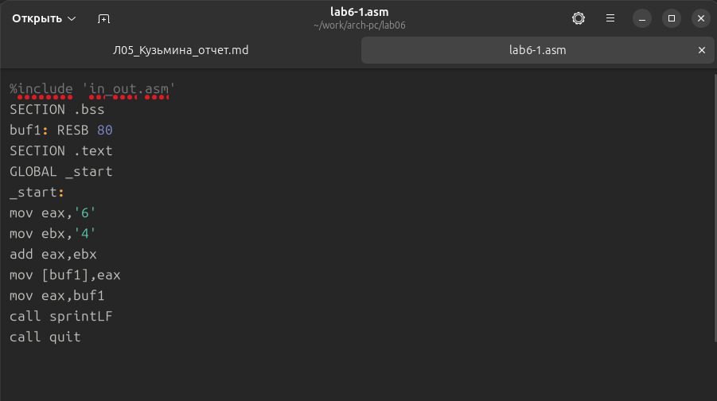
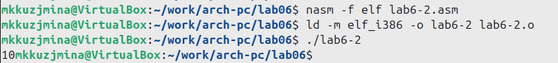

---
## Front matter
title: "Отчёт по лабораторной работе №6"
subtitle: "Дисциплина: Архитектура компьютера"
author: "Кузьмина Мария Константиновна"

## Generic otions
lang: ru-RU
toc-title: "Содержание"

## Bibliography
bibliography: bib/cite.bib

## Pdf output format
toc: true # Table of contents
toc-depth: 2
lof: true # List of figures
fontsize: 12pt
linestretch: 1.5
papersize: a4
documentclass: scrreprt
## I18n polyglossia
polyglossia-lang:
  name: russian
  options:
	- spelling=modern
	- babelshorthands=true
polyglossia-otherlangs:
  name: english
## I18n babel
babel-lang: russian
babel-otherlangs: english
## Fonts
mainfont: IBM Plex Serif
romanfont: IBM Plex Serif
sansfont: IBM Plex Sans
monofont: IBM Plex Mono
mathfont: STIX Two Math
mainfontoptions: Ligatures=Common,Ligatures=TeX,Scale=0.94
romanfontoptions: Ligatures=Common,Ligatures=TeX,Scale=0.94
sansfontoptions: Ligatures=Common,Ligatures=TeX,Scale=MatchLowercase,Scale=0.94
monofontoptions: Scale=MatchLowercase,Scale=0.94,FakeStretch=0.9
mathfontoptions:
## Biblatex
biblatex: true
biblio-style: "gost-numeric"
biblatexoptions:
  - parentracker=true
  - backend=biber
  - hyperref=auto
  - language=auto
  - autolang=other*
  - citestyle=gost-numeric
## Pandoc-crossref LaTeX customization
figureTitle: "Рис."
listingTitle: "Листинг"
lofTitle: "Список иллюстраций"
lolTitle: "Листинги"
## Misc options
indent: true
header-includes:
  - \usepackage{indentfirst}
  - \usepackage{float} # keep figures where there are in the text
  - \floatplacement{figure}{H} # keep figures where there are in the text
---

# Цель работы

Освоение арифметических инструкций языка ассемблера NASM.


# Задание

1. Символьные и численные данные в NASM
2. Выполнение арифметических операций в NASM
3. Выполнение заданий для самостоятельной работы.

# Выполнение лабораторной работы

## Символьные и численные данные в NASM
С помощью mkdir создаем директорию для создания файлов лабораторной работы, переходим в созданный каталог(рис. [-@fig:001]):

{#fig:001 width=100%}


С помощью утилиты touch создаем файл lab6-1.asm, копируем в текущий каталог файл in_out.asm и открываем созданный файл; вставляем в него программу вывода значения регистра eax (рис. [-@fig:002]):

{#fig:002 width=100%} 

Сохраняем исполняемый файл программы и запускаем его (рис. [-@fig:021]):

{#fig:021 width=100%} 

Изменяем в тексте программы символы "6" и "4" на цифры 6 и 4 (рис. [-@fig:003]):

{#fig:003 width=100%}

Создаем новый исполняемый файл программы и запускаем его. При исполнении программы мы не получаем число 10. В данном случае выводится символ с кодом 10. Пользуясь таблицей ASCII определяем, что 10 соответствует символу перевода строки. (рис. [-@fig:004]):

{#fig:004 width=100%}

С помощью touch создаем новый файл lab6-2.asm, открываем mousepad и вводим текст программы для вывода значения регистра eax (рис. [-@fig:005]):

{#fig:005 width=100%}

(рис. [-@fig:006]):

{#fig:006 width=100%}

Создаем и запускаем исполняемый файл lab6-2. На выxоде получаем число 106, потому что программа позволяет вывести число. (рис. [-@fig:007]):

{#fig:007 width=100%}

Заменяем в тексте программы файла lab6-2.asm символы "6" и "4" на числа 6 и 4 (рис. [-@fig:008]):

{#fig:008 width=100%}

Создаем и запускаем новый исполняемый файл. Программа складывает непосредственно сами числа, поэтому вывод 10.

(рис. [-@fig:009]):

{#fig:009 width=100%}


Заменяем в тексте программы функцию iprintLF на iprint (рис. [-@fig:010]):

{#fig:010 width=100%}

Создаем и запускаем новый исполняемый файл. Вывод изменился, потому что iprintLF добавил перенос строки, а iprint нет. (рис. [-@fig:011]):

{#fig:011 width=100%} 

## Выполнение арифметических операций в NASM

Создаем файл lab6-3.asm с помощью touch (рис. [-@fig:012]):

{#fig:012 width=100%}

Вводим в созданный файл текст программы для вычисления значения данного выражения (рис. [-@fig:013]):

{#fig:013 width=100%}

Создаем и запускаем файл (рис. [-@fig:014]):

{#fig:014 width=100%} 


Изменяем текст, чтобы программа вычисляла значение нового выражения (4 * 6 + 2)/5  (рис. [-@fig:015]):

{#fig:015 width=100%}


```
%include 'in_out.asm' ; подключение внешнего файла
SECTION .data
div: DB 'Результат: ',0
rem: DB 'Остаток от деления: ',0
SECTION .text
GLOBAL _start
_start:
; ---- Вычисление выражения
mov eax,4 ; EAX=4
mov ebx,6 ; EBX=6
mul ebx ; EAX=EAX*EBX
add eax,2 ; EAX=EAX+2
xor edx,edx ; обнуляем EDX для корректной работы div
mov ebx,5 ; EBX=5
div ebx ; EAX=EAX/5, EDX=остаток от деления
mov edi,eax ; запись результата вычисления в 'edi'
; ---- Вывод результата на экран
mov eax,div ; вызов подпрограммы печати
call sprint ; сообщения 'Результат: '
mov eax,edi ; вызов подпрограммы печати значения
call iprintLF ; из 'edi' в виде символов
mov eax,rem ; вызов подпрограммы печати
call sprint ; сообщения 'Остаток от деления: '
mov eax,edx ; вызов подпрограммы печати значения
call iprintLF ; из 'edx' (остаток) в виде символов
call quit ; вызов подпрограммы завершения
```

Создаем и запускаем файл (рис. [-@fig:016]):

{#fig:016 width=100%}


Создаем файл variant.asm, вводим в файл текст программы для вычисления варианта по номеру студенческого билета(рис. [-@fig:017]):

{#fig:017 width=100%}


Создаем и запускаем исполняемый файл. Вводим номер своего студенческого билета. (рис. [-@fig:018]):

{#fig:018 width=100%}

1. Какие строки листинга 6.4 отвечают за вывод на экран сообщения ‘Ваш вариант:’?
Ответ: 
```
mov eax,rem
call sprint
```

2. Для чего используется следующие инструкции?
mov ecx, x
mov edx, 80
call sread

Ответ: mov ecx, x — загружает адрес буфера, куда будет сохранён ввод.
mov edx, 80 — указывает максимальное количество символов для ввода (80).
call sread — вызывает функцию для чтения строки с клавиатуры.

3. Для чего используется инструкция “call atoi”?
Ответ: преобразует введённую строку в целое число.

4. Какие строки листинга 6.4 отвечают за вычисления варианта?
Ответ:
```
xor edx,edx 
mov ebx,20 
div ebx 
inc edx 
```

5. В какой регистр записывается остаток от деления при выполнении инструкции “div
ebx”?
Ответ: остаток от деления записывается в регистр edx

6. Для чего используется инструкция “inc edx”?
Ответ: увеличивает значение, находящееся в регистре edx, на 1.

7. Какие строки листинга 6.4 отвечают за вывод на экран результата вычислений?
Ответ: 
```
mov eax,edx
call iprintLF
```

## Выполнение заданий для самостоятельной работы

Создаю и открываем файл lab6-4.asm , вводим в него текст программы для вычисления значения (5 + x)^2 − 3, (вариант 15) (рис. [-@fig:019]):


{#fig:019 width=100%}

```
%include 'in_out.asm'
SECTION .data
msg: DB 'Введите значение x: ',0
rem: DB 'Результат: ',0
SECTION .bss
x: RESB 80
SECTION .text
GLOBAL _start
_start:
mov eax, msg
call sprintLF
mov ecx, x
mov edx, 80
call sread
mov eax,x ; вызов подпрограммы преобразования
call atoi ; ASCII кода в число, `eax=x`
add eax,5
mov ebx,eax
mul ebx
add eax,-3
mov edi,eax
mov eax,rem
call sprint
mov eax,edi
call iprintLF
call quit
```
Создаем и запускаем исполняемый файл, после вводим значения x1, x2 (рис. [-@fig:020]):

{#fig:020 width=100%}


# Выводы
При выполнении лабораторной работы были освоены арифметические инструкции языка ассемблера NASM.
