---
## Front matter
title: "Отчёт по лабораторной работе №9"
subtitle: "Дисциплина: Архитектура компьютера"
author: "Кузьмина Мария Константиновна"

## Generic otions
lang: ru-RU
toc-title: "Содержание"

## Bibliography
bibliography: bib/cite.bib

## Pdf output format
toc: true # Table of contents
toc-depth: 2
lof: true # List of figures
fontsize: 12pt
linestretch: 1.5
papersize: a4
documentclass: scrreprt
## I18n polyglossia
polyglossia-lang:
  name: russian
  options:
	- spelling=modern
	- babelshorthands=true
polyglossia-otherlangs:
  name: english
## I18n babel
babel-lang: russian
babel-otherlangs: english
## Fonts
mainfont: IBM Plex Serif
romanfont: IBM Plex Serif
sansfont: IBM Plex Sans
monofont: IBM Plex Mono
mathfont: STIX Two Math
mainfontoptions: Ligatures=Common,Ligatures=TeX,Scale=0.94
romanfontoptions: Ligatures=Common,Ligatures=TeX,Scale=0.94
sansfontoptions: Ligatures=Common,Ligatures=TeX,Scale=MatchLowercase,Scale=0.94
monofontoptions: Scale=MatchLowercase,Scale=0.94,FakeStretch=0.9
mathfontoptions:
## Biblatex
biblatex: true
biblio-style: "gost-numeric"
biblatexoptions:
  - parentracker=true
  - backend=biber
  - hyperref=auto
  - language=auto
  - autolang=other*
  - citestyle=gost-numeric
## Pandoc-crossref LaTeX customization
figureTitle: "Рис."
listingTitle: "Листинг"
lofTitle: "Список иллюстраций"
lolTitle: "Листинги"
## Misc options
indent: true
header-includes:
  - \usepackage{indentfirst}
  - \usepackage{float} # keep figures where there are in the text
  - \floatplacement{figure}{H} # keep figures where there are in the text
---

# Цель работы

Приобретение навыков написания программ с использованием подпрограмм. Знакомство с методами отладки при помощи GDB и его основными возможностями.


# Задание

1. Реализация подпрограмм в NASM
2. Отладка программ с помощью GDB
3. Выполнение заданий для самостоятельной работы.


# Выполнение лабораторной работы

## Реализация подпрограмм в NASM
С помощью mkdir создаем директорию для создания файлов лабораторной работы, переходим в созданный каталог(рис. [-@fig:001]):

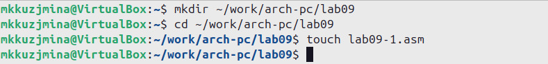{#fig:001 width=100%}


Копируем в файл код из листинга и запускаем его, данная программа выполняет вычисление функции  (рис. [-@fig:002]):

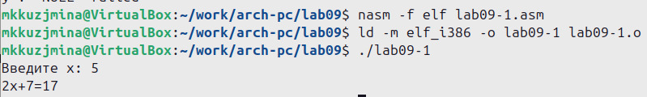{#fig:002 width=100%} 

Изменяем текст программы, добавив подпрограмму _subcalcul в подпрограмму _calcul, для вычисления выражения 𝑓(𝑔(𝑥)), где 𝑥 вводится с клавиатуры, 𝑓(𝑥) = 2𝑥 + 7, 𝑔(𝑥) = 3𝑥 − 1. Т.е. 𝑥 передается в подпрограмму _calcul из нее в подпрограмму _subcalcul, где
вычисляется выражение 𝑔(𝑥), результат возвращается в _calcul и вычисляется выражение
𝑓(𝑔(𝑥)). (рис. [-@fig:003])

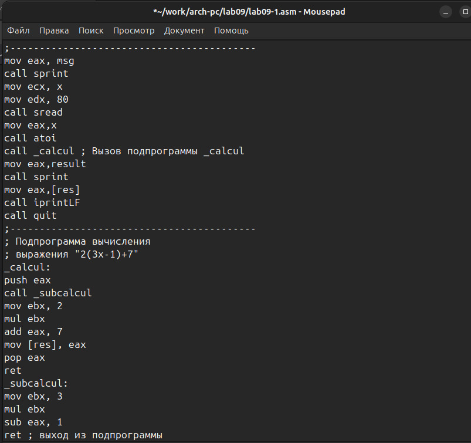{#fig:003 width=100%} 

(рис. [-@fig:005]):
 
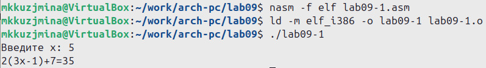{#fig:005 width=100%}

```
%include 'in_out.asm'
SECTION .data
msg: DB 'Введите x: ',0
result: DB '2(3x-1)+7=',0
SECTION .bss
x: RESB 80
res: RESB 80
SECTION .text
GLOBAL _start
_start:
;------------------------------------------
; Основная программа
;------------------------------------------
mov eax, msg
call sprint
mov ecx, x
mov edx, 80
call sread
mov eax,x
call atoi
call _calcul ; Вызов подпрограммы _calcul
mov eax,result
call sprint
mov eax,[res]
call iprintLF
call quit
;------------------------------------------
; Подпрограмма вычисления
; выражения "2(3x-1)+7"
_calcul:
push eax
call _subcalcul
mov ebx, 2
mul ebx
add eax, 7
mov [res], eax
pop eax
ret
_subcalcul:
mov ebx, 3
mul ebx
sub eax, 1
ret ; выход из подпрограммы
```

## Отладка программ с помощью GDB

Создаем файл lab09-2.asm с текстом программы, в созданный файл копируем программу второго листинга, транслируем с созданием файла листинга и отладки, компонуем и запускаем в отладчике (рис. [-@fig:006]):

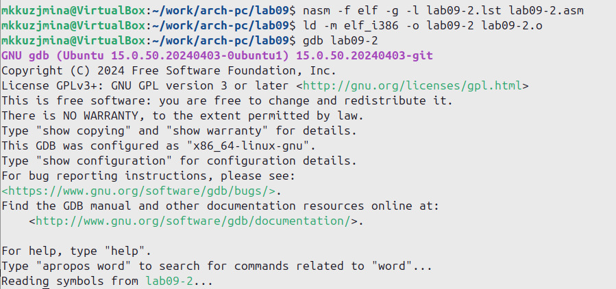{#fig:006 width=100%}

Проверяем работу программы, запустив ее в оболочке GDB с помощью команды run (рис. [-@fig:008]):

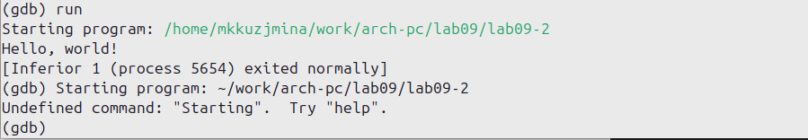{#fig:008 width=100%}


Для более подробного анализа программы устанавливаем брейкпоинт на метку _start, с которой начинается выполнение любой ассемблерной программы, и запускаем её (рис. [-@fig:009]):

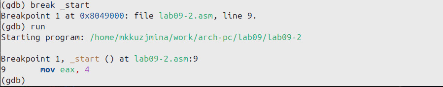{#fig:009 width=100%}

Смотрим дисассимилированный код программы с помощью команды disassemble начиная с метки _start (рис. [-@fig:010]):

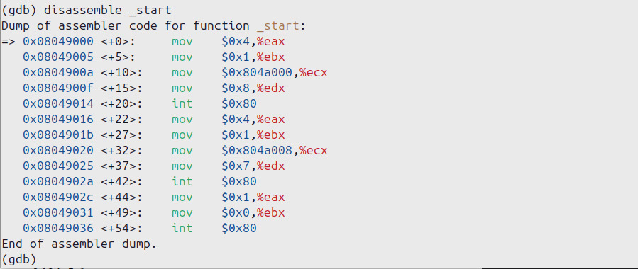{#fig:010 width=100%}

Переключаемся на отображение команд с Intel’овским синтаксисом, введя команду set disassembly-flavor intel (рис. [-@fig:011]):

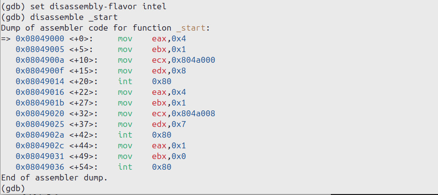{#fig:011 width=100%} 


Включаем режим псевдографики для более удобного анализа программы (рис. [-@fig:012]):

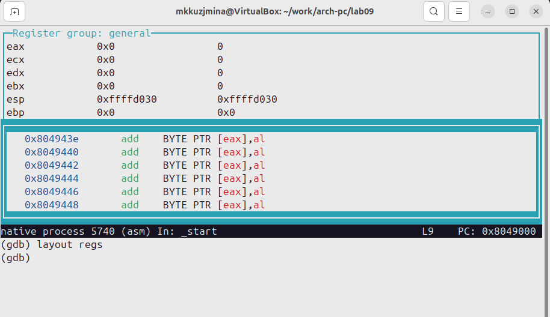{#fig:012 width=100%}

Установливаем точку останова (рис. [-@fig:013]):

{#fig:013 width=100%}

Смотрим содержимое регистров с помощью команды info registers (рис. [-@fig:014]):

{#fig:014 width=100%} 


Смотрим значение переменной msg1 по имени (рис. [-@fig:015]):

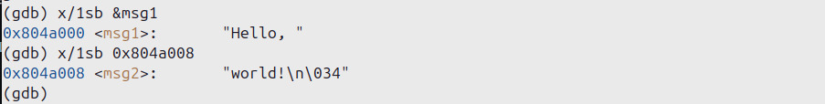{#fig:015 width=100%}


Изменяем первый символ переменной msg1 (рис. [-@fig:016]):

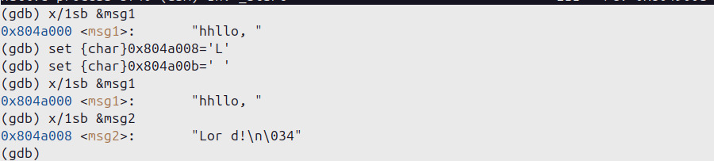{#fig:016 width=100%}


Выводим в различных форматах значение регистра edx  (рис. [-@fig:017]):

{#fig:017 width=100%}


С помощью команды set меняем содержимое регистра ebx (рис. [-@fig:018]):

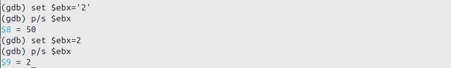{#fig:018 width=100%}

Копируем файл lab8-2.asm, созданный при выполнении лабораторной работы №8,с программой выводящей на экран аргументы командной строки (Листинг 8.2) в файл с именем lab09-3.asm (рис. [-@fig:019]):

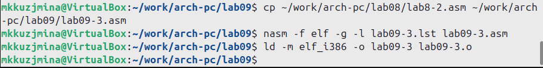{#fig:019 width=100%}

Для загрузки в gdb программы с аргументами используем ключ --args.
Загружаем исполняемый файл в отладчик, указав аргументы. Установливаем точку останова перед первой инструкцией в программе и запускаем
ее (рис. [-@fig:020]):

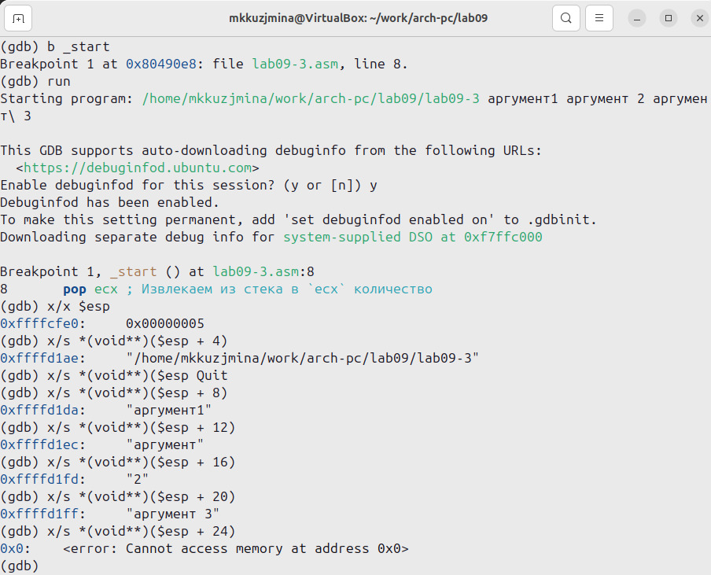{#fig:020 width=100%}


## Выполнение заданий для самостоятельной работы

Преобразовываем программу из лабораторной работы №8 (Задание №1 для самостоятельной работы), реализовав вычисление значения функции 𝑓(𝑥) как подпрограмму (рис. [-@fig:021]):


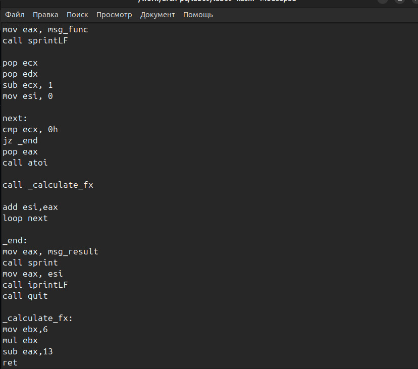{#fig:021 width=100%}

```
%include 'in_out.asm'

SECTION .data
msg_func db "Функция: f(x) = 6x + 13", 0
msg_result db "Результат: ", 0

SECTION .text
GLOBAL _start

_start:
mov eax, msg_func
call sprintLF

pop ecx
pop edx
sub ecx, 1
mov esi, 0

next:
cmp ecx, 0
jz _end
pop eax
call atoi

mov ebx, 6
mul ebx
add eax, 13
add esi, eax

loop next

_end:
mov eax, msg_result
call sprint
mov eax, esi
call iprintLF
call quit
```
Запускаем программу в режике отладичка и пошагово просматриваем изменение значений регистров через i r. При выполнении инструкции mul ecx можно заметить, что результат умножения записывается в регистр eax, но также меняет и edx. Значение регистра ebx не обновляется напрямую, поэтому результат программа неверно подсчитывает функцию (рис. [-@fig:022]):


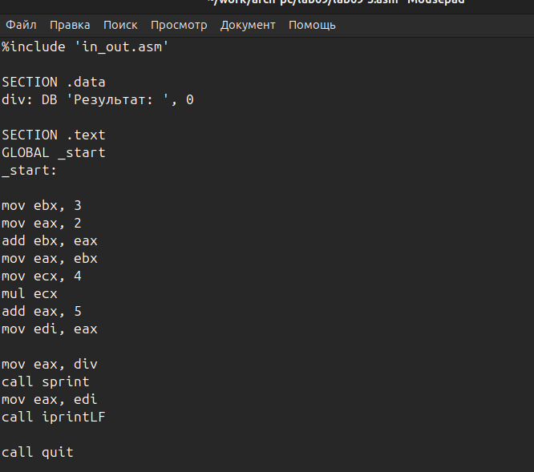{#fig:022 width=100%}


```
%include 'in_out.asm'

SECTION .data
div: DB 'Результат: ', 0

SECTION .text
GLOBAL _start
_start:

mov ebx, 3
mov eax, 2
add ebx, eax
mov eax, ebx
mov ecx, 4
mul ecx
add eax, 5
mov edi, eax

mov eax, div
call sprint
mov eax, edi
call iprintLF

call quit
```
Исправляем найденную ошибку, теперь программа верно считает значение функции (рис. [-@fig:023]):

{#fig:023 width=100%}

# Выводы

При выполнении лабораторной работы были приобретены навыки написания программ с использованием подпрограмм. Ознакомились с методами отладки при помощи GDB и его основными возможностями.
